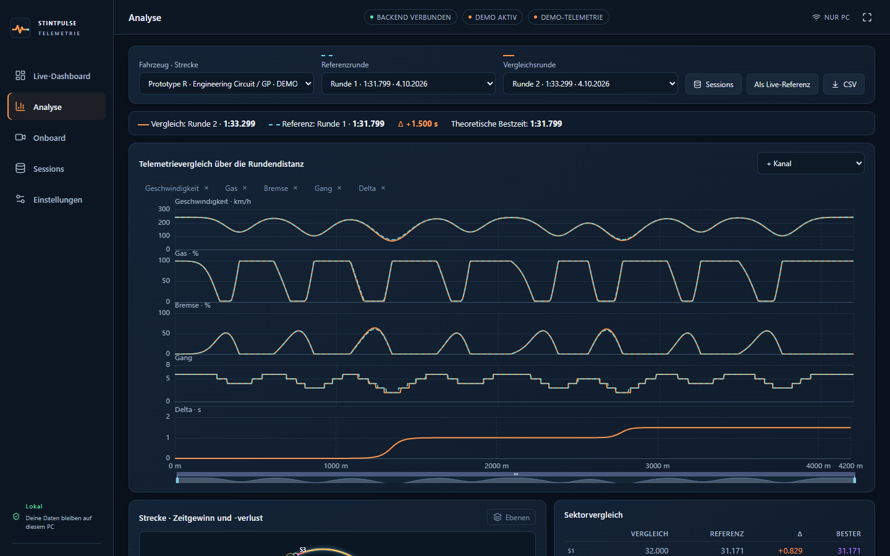

# StintPulse

**Telemetrie, Analyse und Onboard-Video für das originale Assetto Corsa – lokal auf deinem PC.**

StintPulse liest während der Fahrt die Telemetrie aus Assetto Corsa, zeichnet jede Runde mit Sektorzeiten auf, zeigt Streckenkarte, Reifen und Delta live im Browser und auf dem Handy, vergleicht Runden über die Distanz und nimmt auf Wunsch das Onboard-Video (OBS Virtual Camera) mit Spielsound auf – jede Runde später mit Zeiten-HUD ansehbar. Alle Daten bleiben auf deinem PC; es gibt kein Konto und keinen Cloud-Upload.



## Download und Installation (für Nutzer)

1. **StintPulse-x.y.z-Setup.exe** von **https://github.com/kcuzf1-afk/StintPulse/releases/latest** laden und starten (Webseite: https://kcuzf1-afk.github.io/StintPulse/). Keine Administratorrechte nötig; installiert wird nach `%LOCALAPPDATA%\Programs\StintPulse`.
   Alternativ die **ZIP-Version** entpacken und `StintPulse.exe` starten (portabel: liegt neben der EXE ein Ordner `Daten`, bleiben alle Daten darin).
2. Windows zeigt bei neuen, (noch) nicht signierten Programmen eventuell „Der Computer wurde durch Windows geschützt“: **Weitere Informationen → Trotzdem ausführen.**
3. StintPulse startet und öffnet das Dashboard im Browser (`http://localhost:8765`). Das schwarze Fenster offen lassen, solange du fährst.
4. Assetto Corsa (auch über Content Manager) starten und auf die Strecke gehen – die Verbindung entsteht automatisch. Ohne Spiel zeigt **Demo** synthetische Beispieldaten.

Voraussetzungen: Windows 10 (1809) oder 11, 64 Bit, originales Assetto Corsa (nicht ACC; CSP nicht nötig). Für Onboard-Video: OBS mit „Virtuelle Kamera starten“. Daten: `%LOCALAPPDATA%\StintPulse` (Datenbank, Videos, Ton, Protokoll); Deinstallieren löscht sie nicht.

StintPulse ist ein unabhängiges Projekt und nicht mit Kunos Simulazioni verbunden. Assetto Corsa ist eine Marke von Kunos Simulazioni.

## Schnellstart für Entwickler

Voraussetzungen: Windows 10/11 x64, **Python 3.12 x64** mit `py`-Launcher, **Node.js 24** mit npm. Dieses Repository vollständig entpacken, einschließlich `frontend/dist` aus dem Download. Im Projektordner PowerShell öffnen:

```powershell
.\scripts\install.ps1
.\scripts\start.ps1 -Demo
```

Dashboard: **http://localhost:8765**. Zwei synthetische Runden stehen sofort für Analyse und Coaching bereit; eine weitere Runde läuft live. Alle Demo-Daten sind eindeutig als `demo` gekennzeichnet.

Falls PowerShell lokale Skripte blockiert, gilt diese Einstellung nur für das aktuelle Terminal:

```powershell
Set-ExecutionPolicy -Scope Process -ExecutionPolicy Bypass
```

Dann die beiden Befehle erneut ausführen. Keine Administratorrechte erforderlich. Zum Beenden im Server-Terminal **Strg+C** drücken.

## 1. Entwicklungsumgebung installieren

Der zentrale Python-Paketvertrag ist `pyproject.toml` im Projektroot. Frontend-Versionen sind in `frontend/package-lock.json`, Python-Versionen in `requirements-lock.txt` festgeschrieben. Ein zusätzliches `backend/pyproject.toml` ist nicht erforderlich.

```powershell
py -3.12 -m venv .venv
.\.venv\Scripts\python.exe -m pip install -r requirements-lock.txt
.\.venv\Scripts\python.exe -m pip install --no-deps -e .
cd frontend
npm ci
npm run build
cd ..
```

Der Download enthält auch den getesteten Frontend-Produktionsbuild. `install.ps1` baut ihn aus dem Quellcode erneut. Die erste Installation lädt Pakete; danach benötigt die Anwendung für ihre Grundfunktionen keinen Internetzugang.

Linux/macOS können Demo, Analyse und Tests ausführen, jedoch nicht die Windows-Shared-Memory-Verbindung:

```bash
python3.12 -m venv .venv
.venv/bin/python -m pip install -r requirements-lock.txt
.venv/bin/python -m pip install --no-deps -e .
cd frontend
npm ci
npm run build
cd ..
.venv/bin/python -m ac_agent --demo --no-browser
```

## 2. Backend starten

```powershell
.\.venv\Scripts\python.exe -m ac_agent --ac
```

Standardmäßig bindet der Server an `127.0.0.1:8765`. Das gebaute Dashboard wird direkt von FastAPI ausgeliefert. `--no-browser` unterdrückt das automatische Öffnen. `--port 8766` überschreibt den Port für diesen Start. `--data-dir C:\ACData` setzt einen separaten Datenordner. Ohne Option: `%LOCALAPPDATA%\StintPulse\telemetry.sqlite`. **Portabel:** Liegt neben der EXE ein Ordner `Daten`, speichert die gepackte App alles dort (Datenbank, Videos, Ton, Protokoll). So ist der ganze App-Ordner (z. B. `Dokumente\AC Engineering 0.1`) in sich geschlossen und kann verschoben werden; Videos werden nach dem Verschieben automatisch wiedergefunden.

## 3. Frontend im Entwicklungsmodus starten

Backend wie oben starten. In einem zweiten Terminal:

```powershell
cd frontend
npm run dev
```

http://localhost:5173 öffnen. Vite leitet `/api` und `/ws` an `127.0.0.1:8765` weiter. Bei einem anderen Backend-Port `frontend/vite.config.ts` anpassen. Für Tablet/LAN den Produktionsbuild verwenden.

## 4. Assetto Corsa verbinden

1. Original-AC über Steam oder Content Manager starten.
2. Eine Fahrsession öffnen; der eigentliche Spielprozess muss `acs.exe` oder `acs_x86.exe` heißen.
3. App im AC-Modus starten oder im Dashboard **AC verbinden** anklicken.
4. Die App erkennt `acpmf_physics`, `acpmf_graphics` und `acpmf_static` automatisch und öffnet sie ausschließlich lesend. Oben rechts stehen getrennt **Backend**-Verbindung (Browser ↔ lokaler Server) und **Spielstatus**. Bei Problemen **Einstellungen → Erweitert / Diagnose** öffnen (oder `GET /api/diagnostics`); „Verbindung erneut prüfen“ verbindet ohne Neustart neu. Jeder Programmstart nutzt das echte Spiel, außer `--demo` wird angegeben.
5. Eine vollständige Runde fahren. Nach der Ziellinie erscheinen Runde, Sektoren und Telemetrie im Session-Archiv.

Für eine zusätzliche lokale Prüfung auf Windows:

```powershell
.\.venv\Scripts\python.exe scripts\check_ac_live.py --seconds 8
```

Das Skript liest die drei vorhandenen Seiten und meldet echte Aktualisierungsrate, Version und Fahrzeug/Strecke. Es schreibt keine Telemetrie und erzeugt keine Shared-Memory-Seiten.

Es ist keine AC-Python-App und kein UDP-Plug-in im Spiel zu installieren. CSP ist nicht nötig. Werden App oder Strecke mitten in einer Runde geöffnet, bleibt diese Runde als unvollständig gespeichert und zählt nicht als Bestzeit. Original-AC hat im verifizierten Basis-ABI kein eindeutiges `isValidLap`: Gültigkeit ist daher aus Off-Track-, Pit-, Straf- und Aufzeichnungslücken **abgeleitet**, nicht vom Spiel offiziell bestätigt.

## 5. Demo-Modus

```powershell
.\.venv\Scripts\python.exe -m ac_agent --demo
```

Alternativ **Demo starten** im Dashboard. Der Demo-Modus erzeugt alle Live-Kanäle, vier Reifen, Koordinaten, Gangwechsel und Sektorzeiten; zwei synthetische Vergleichsrunden werden für jede neue Demo-Session vorab erzeugt. Die zweite Runde verliert Geschwindigkeit in geschätzten Kurven 3 und 6. Der Coach berechnet daraus die Hinweise. Reale Daten und Demo-Daten werden bei Vergleich, Bestzeiten, Maps und Import getrennt gehalten. Der Wechsel der Datenquelle erzeugt eine neue Session.

## 6. Windows-EXE und Installer erstellen

**Auf Windows bauen**, mit derselben Python-/Node-Version und den Lockdateien:

```powershell
.\scripts\build-windows.ps1
```

Das Skript führt Frontend-Tests, TypeScript-Build, Backend-Tests und PyInstaller aus. Anschließend startet ein Smoke-Test die erzeugte EXE auf einem freien Port und überprüft die Demo-Telemetrie.

Ergebnisse in `dist\` (Version aus `backend/ac_agent/__init__.py`):

- `StintPulse\StintPulse.exe` plus erforderlicher `_internal`-Ordner,
- `StintPulse-<version>-Windows.zip` (portabel),
- `StintPulse-<version>-Setup.exe` (Installer, benötigt Inno Setup 6: `winget install JRSoftware.InnoSetup`; ohne: `-NoInstaller`),
- `SHA256SUMS.txt` (Prüfsummen für die Download-Seite).

Den **gesamten Ordner** kopieren; die einzelne EXE reicht nicht. Das Packaging verwendet `onedir`, um wiederholtes Entpacken großer NumPy-Bibliotheken beim Start zu vermeiden. `packaging/installer.iss` installiert pro Benutzer (Deutsch/Englisch, Startmenü, optional Desktop-Symbol, Deinstallation; Nutzerdaten bleiben erhalten).

**Veröffentlichen:** `UPDATE_REPO` in `backend/ac_agent/__init__.py` auf das GitHub-Repository setzen (`besitzer/name`), Version erhöhen, `RELEASE_NOTES.md` aktualisieren und einen Tag `v<version>` pushen. Der Workflow `.github/workflows/verify.yml` baut dann auf Windows, testet und veröffentlicht Installer, ZIP und Prüfsummen als GitHub-Release; die App zeigt Nutzern daraufhin einen Update-Hinweis. Die Download-Seite liegt in `website/` (GitHub Pages).

## 7. Smartphone oder Tablet im LAN (mit Live-Onboard)

1. Einstellungen → **LAN-Zugriff aktivieren** → Speichern. Darunter steht der **8-stellige Zugriffscode** (nur am PC sichtbar) und die Adresse für das Handy, z. B. `http://192.168.178.49:8765`.
2. App beenden und neu starten (LAN braucht den Neustart). Das Konsolenfenster zeigt den Code ebenfalls an.
3. Windows-Firewall einmalig für den Port freigeben (PowerShell als Administrator; nur nötig, weil eine Firewall-Regel angelegt wird). Ist das Netzwerk in Windows als „Öffentlich“ eingestuft, es auf **„Privat“** umstellen oder `-Profile Any` verwenden:
   ```powershell
   New-NetFirewallRule -DisplayName "StintPulse" -Direction Inbound -Protocol TCP -LocalPort 8765 -Action Allow -Profile Private
   ```
4. Handy ins selbe WLAN, Adresse aus Schritt 1 öffnen, Code eingeben → **Verbinden**.
5. **Live-Onboard aufs Handy:** am PC Videoquelle **OBS Virtual Camera / Webcam** wählen, in OBS „Virtuelle Kamera starten“ und das Dashboard **am PC** auf *Engineering* oder *Onboard* geöffnet lassen. Auf dem Handy *Onboard* öffnen: das PC-Bild erscheint mit HUD („PC-BILD LIVE · WEBRTC“). Die Onboard-Leiste am PC zeigt die Zahl der zuschauenden Geräte.

Zugriffscode:

- 8 Ziffern, zufällig (kryptografisch) erzeugt. Ältere lange Zugriffstoken werden beim ersten Start automatisch durch einen neuen Code ersetzt.
- Der PC selbst (localhost) braucht keinen Code; Handy/Tablet schon. Der Code wird nur am PC angezeigt und nie protokolliert.
- **Neuen Code erzeugen** (Einstellungen am PC) trennt sofort alle verbundenen Geräte.
- Nach 10 **verschiedenen** falschen Codes ist ein Gerät 60 s gesperrt (Schutz gegen Durchprobieren). Aufrufe ohne Code (vor der Eingabe) und ein wiederholt gesendeter gleicher Tippfehler zählen nicht.
- Der Code liegt auf dem Handy nur in `sessionStorage` (nach Schließen des Tabs neu eingeben), nicht in der URL.

Video-Übertragung: WebRTC direkt PC → Handy innerhalb des LAN, ohne externe STUN/TURN-Server und ohne Cloud. Der Server vermittelt nur den Verbindungsaufbau (`/ws/onboard`, mit Code geschützt). Nur der PC selbst darf senden. Das Video läuft unabhängig von der Telemetrie; reißt die Verbindung ab, baut das Handy sie automatisch neu auf.

HTTP ist unverschlüsselt (Code und Telemetrie; das WebRTC-Video selbst ist immer verschlüsselt). Für HTTPS:

```powershell
.\.venv\Scripts\python.exe -m ac_agent --ac --cert C:\TLS\server.crt --key C:\TLS\server.key
```

Das Zertifikat muss die private IP abdecken und auf dem Handy vertrauenswürdig sein. Keine Router-Portweiterleitung einrichten; die App ist ein lokaler Dienst.

## 8. Live-Onboard / OBS

Neu: **Rundenzeit-HUD** oben rechts über dem Onboard-Bild (Position, Fahrer, Reifen, Rundenzeit, S1–S3 farbig, Referenz = persönliche Bestzeit) – verschiebbar, skalierbar, auch im Vollbild; Details in [docs/ONBOARD.md](docs/ONBOARD.md#rundenzeit-hud-über-dem-onboard-bild).

Neu: **Onboard automatisch aufnehmen** – während der Fahrt nimmt der Dashboard-Tab auf dem PC das OBS-Bild auf (WebM, ein Video pro Session, laufend auf die Festplatte geschrieben und danach spulbar indiziert). In **Sessions** startet **Onboard ansehen** genau die gewählte Runde mit dem HUD aus den gespeicherten Daten. Den **Ton** nimmt das PC-Programm selbst aus Windows auf (Standard: nur Spielsound von Assetto Corsa) und spielt ihn synchron zum Bild ab. Der Browser-Tab auf dem PC muss dafür geöffnet bleiben. Details: [docs/ONBOARD.md](docs/ONBOARD.md#onboard-automatisch-aufnehmen-video-pro-session-runde-ansehen).

Neu: **OBS Virtual Camera** als Live-Onboard-Quelle. In OBS „Virtuelle Kamera starten“, in den Einstellungen Videoquelle **OBS Virtual Camera / Webcam** wählen, im Browser die Kamera erlauben. Die App wählt die OBS-Kamera automatisch und verbindet nach einem OBS-Neustart selbst neu. Details: [docs/ONBOARD.md](docs/ONBOARD.md).

Einstellungen → Videoquelle:

- **Browser · Window capture**: Im Onboard-Panel **Fenster freigeben** wählen und das AC-Spiel auswählen. Diese lokale Browser-Freigabe funktioniert auf localhost oder HTTPS; Berechtigung erteilt der Benutzer. Sie ersetzt in diesem Release einen eigenen nativen Windows-Graphics-Capture-Adapter.
- **Direct video URL**: Eine direkte vom Browser unterstützte MP4-/WebM-/Streaming-URL eintragen. RTMP, NDI und OBS-WebSocket-URLs sind keine direkt abspielbaren Videoquellen.
- **Local recording**: Eine OBS-Aufnahme im Onboard-Panel öffnen. Das Session-Archiv enthält eine Replay-Schaltfläche pro Runde. Auch eine vollständige Session lässt sich als Playlist wiedergeben. Der konfigurierte Video-Offset synchronisiert die separat geladene Aufnahme mit der Telemetrie-Timeline.

Vollbild, Picture-in-Picture und HUD-Overlay sind enthalten. Keine Videoquelle blockiert die Telemetrie. Details und die OBS-Einrichtung stehen in [docs/ONBOARD.md](docs/ONBOARD.md). Ein eigener nativer WGC-, OBS-Steuerungs-, NDI- oder WebRTC-Server ist nicht Bestandteil dieses Release.

## Bedienung und Analyse

Die Navigation hat fünf Bereiche mit je einem klaren Zweck:

| Bereich | Zweck |
|---|---|
| Live-Dashboard | die laufende Fahrt: Session, aktuelle/beste/letzte Runde, Delta, Kraftstoff mit Reichweite, Tempo/Gang/Drehzahl/Pedale, Streckenkarte, Reifen, Sektoren, Warnungen, kompakte Live-Telemetrie; weitere Fahrzeugdaten aufklappbar |
| Analyse | Rundenvergleich aus gespeicherten Sessions: Referenz- und Vergleichsrunde wählen (nur kompatible Runden), Diagramme über die Rundendistanz in Metern, Delta-Verlauf, Sektorvergleich, theoretische Bestzeit, Karte mit Zeitgewinn/-verlust, Engineering-Coach; funktioniert ohne laufendes Spiel |
| Onboard | großes Video mit Rundenzeit-HUD, optional Tacho (Tempo, Gang, Pedale); Videoquelle, HUD, Vollbild; Infos-Seitenpanel (standardmäßig zu); Wiedergabe gespeicherter Runden |
| Sessions | Archiv: Suche, Filter, Rundenauswahl, Import/Export, Backup; **In Analyse vergleichen** übergibt zwei Runden an die Analyse |
| Einstellungen | Allgemein · Daten und Speicherung · Onboard und HUD · Netzwerk · Erweitert / Diagnose |

Alte Adressen funktionieren weiter: `#/engineering`, `#/live-mode`, `#/tablet` führen zum Live-Dashboard, `#/diagnostics` zu Einstellungen → Erweitert / Diagnose. Der frühere Tablet-Bereich ist entfallen; das Live-Dashboard passt sich selbst an Handy- und Tabletbreiten an (LAN-Zugriff unverändert).

Kopfzeile: vier getrennte Zustände – **Backend** (Browser ↔ PC-Programm), **Assetto Corsa** (Spielstatus), **Telemetrie** (kommen neue Messwerte an?) und im Onboard **Video**. Werden keine neuen Werte mehr empfangen, steht „Letzter Stand HH:MM:SS“ und die Werte werden abgeblendet – alte Werte erscheinen nie als Live-Daten. CPU-, RAM- und Datenvolumen-Anzeigen stehen nur noch unter Erweitert / Diagnose; dort auch die technischen Fehlerdetails. Fehlermeldungen in der Oberfläche sind verständlich formuliert und nennen eine Handlung.


In **Sessions** zwei passende Runden markieren und **In Analyse vergleichen** wählen – oder direkt in **Analyse** Fahrzeug/Strecke, Referenz- und Vergleichsrunde wählen. Vergleich = orange durchgezogen, Referenz = cyan gestrichelt. Kanäle hinzufügen/entfernen, per Mausrad zoomen, ziehen zum Verschieben. Cursor, markierter Abschnitt und Karte sind gekoppelt (Klick in Karte, Kurventabelle oder Coach-Hinweis). **Als Live-Referenz** übernimmt die Referenz für Delta und HUD während der Fahrt; **Live: persönliche Bestzeit** stellt das wieder um.

CSV-/JSON-Export pro Runde, kompletter Session-JSON-Export, Session-Import, Favoriten, Suche, Löschen sowie vollständige SQLite-Backups sind enthalten. JSON-Import maximal 64 MiB; für größere Archive den SQLite-Backupweg nutzen. SQLite-Wiederherstellung maximal 2 GiB und 192 MiB entpackte Telemetrie pro Runde. Wiederherstellung fügt Daten mit neuen IDs hinzu und überschreibt vorhandene Sessions nicht. Settings/Tokens sind im Backup nicht enthalten.

Optionaler Parquet-Export:

```powershell
.\.venv\Scripts\python.exe -m pip install pyarrow==20.0.0
```

Dann `GET /api/laps/<lap-id>/export?format=parquet` verwenden; im LAN Bearer-Token mitgeben. Ein fehlendes optionales Paket liefert einen verständlichen HTTP-501-Fehler. Parquet ist nicht in der Standard-EXE enthalten.

## Tests und Messungen

```powershell
.\.venv\Scripts\python.exe -m pytest -q
cd frontend
npm test
npm run build
cd ..
.\.venv\Scripts\python.exe scripts\benchmark.py --seconds 30 --output docs\performance-latest.json
```

Eingecheckte Demo-Aufzeichnungen und unabhängig gepackte ABI-Binärseiten machen die Tests reproduzierbar. Die Datei `docs/VERIFICATION.md` enthält tatsächlich ausgeführte Prüfungen und Grenzen. CPU/RAM/WS-Volumen erscheinen zusätzlich unten im Dashboard. Die Messung unter Linux mit synthetischen Daten ersetzt keinen Belastungstest während AC auf Windows läuft.

Zusätzliche Browser-Integrationstests (Live-Updates, Analyse, Mobile-Layout, CSV und Session-Replay):

```powershell
cd frontend
npx playwright install chromium
cd ..
.\.venv\Scripts\python.exe scripts\browser_tests.py
```

Das Skript startet einen isolierten Demo-Server auf einem freien Port, führt die Browserprüfungen aus und beendet ihn wieder. Es verwendet nicht das persönliche Session-Archiv.

## Projektstruktur

```text
backend/ac_agent/   Datenadapter, Modelle, Erfassung, SQLite, Analyse, HTTP/WS
frontend/src/      React, TypeScript, ECharts, SVG-Trackmap, Video, Design-Tokens
frontend/dist/     Mitgeliefertes getestetes Dashboard
tests/             Backend-Tests und aufgezeichnete synthetische Fixtures
scripts/           Installation, Start, Build, Fixtures und Benchmark
packaging/         PyInstaller-Spec, Einstiegspunkt, Inno-Setup-Installer
docs/              Handbuch, Architektur, Quellen, Algorithmen, Grenzen, Screenshots
```

Weiterlesen: [Benutzerhandbuch](docs/USER_GUIDE.md), [Architektur](docs/ARCHITECTURE.md), [Algorithmen](docs/ALGORITHMS.md), [Datenfelder und Quellen](docs/DATA_SOURCES.md), [Fehlerbehebung](docs/TROUBLESHOOTING.md).
