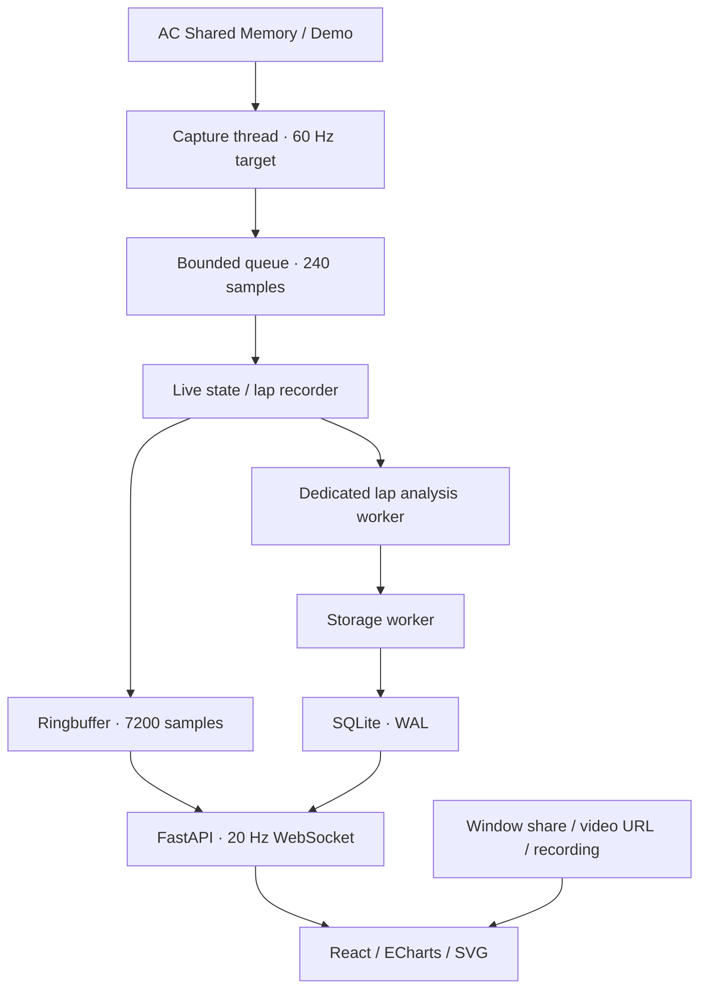

# Technische Architektur

Python 3.12 liest den originalen Windows-Speichervertrag. FastAPI liefert JSON, ein WebSocket und den gebauten React-/TypeScript-Client aus. NumPy übernimmt Distanzinterpolation und statistische Analyse; Pandas ist dafür nicht erforderlich. ECharts zeichnet synchronisierte Kanäle, SVG die gemessene Trackmap. Die Videoquelle ist ein unabhängiges Browser-Subsystem. Grundfunktionen haben keine Cloud-Abhängigkeit. Der Setup-Assistent besteht aus diesen Modulen:

- `ac_setup.py`: verlustfreie INI-Verarbeitung, Grenzen und Kodierung,
- `setup_kpis.py`: Kennwerte und Rundenauswahl,
- `setup_ai.py`: austauschbarer Anbieter, Anthropic-SDK, Schema und deterministische Prüfung,
- `setup_store.py`: Versionen und Analysen,
- `setup_api.py`: die Schnittstellen.

Nur auf Klick ruft er den gewählten KI-Anbieter auf.

## Erfassung und Zustandsmodell

`ACSource` stellt reine Binärdekodierung und den Windows-Leser bereit. `DemoSource` erzeugt ausschließlich Samples mit `source=demo`. Die Erfassung läuft getrennt vom Event Loop. Unveränderte Pakete werden nicht wiederholt aufgezeichnet. AC kann Quelle oder Clock langsamer aktualisieren als der konfigurierte Polling-Takt; die App erzeugt daraus keine 60-Hz-Messwerte.

`LapRecorder` startet nur bei `AC_LIVE=2`. Pause/Menu/Replay werden nicht als neue Live-Samples gespeichert. Ein erhöhtes `completedLaps` zusammen mit `iLastTime` schließt die vorherige Runde. Offizielle Sektorwechsel liefern `lastSectorTime`; der letzte Sektor wird als Rest zur offiziellen Gesamtzeit berechnet. Synthetisch interpolierte Start-/Ziel-Endpunkte sind ausdrücklich `synthetic_boundary=true`. Teleports, Counter-Resets, große Distanzlücken, Pit-Durchfahrt, Strafen und drei Reifen außerhalb machen die abgeleitete Runde ungültig. Eine beim Verbinden schon laufende Runde ist unvollständig.

Eine neue Session entsteht bei Quell-, Fahrer-, Fahrzeug-, Strecken-, Layout-, Sessiontyp-Wechsel, zurückgesetztem Rundenzähler oder längerer Neuverbindung. Angebrochene alte Runden werden mit Grund gespeichert. Beim normalen Beenden wird eine unvollständige letzte Runde gesichert. Abruptes Beenden vor dem Rundenabschluss kann die noch nur im RAM vorhandene aktuelle Runde verlieren; bereits abgeschlossene SQLite-Transaktionen bleiben erhalten.

## Analyse

Spline-Station × Tracklänge wird auf ein 5-m-Raster gebracht. Chronologisch rückläufige oder doppelte Distanzen werden nicht einfach sortiert. Gear ist treppenförmig, kontinuierliche Kanäle werden linear interpoliert. Große Lücken über 100 m bleiben null. Daten außerhalb tatsächlich erfasster Start-/Endbereiche werden nicht extrapoliert. Delta ist `elapsed_lap(s) − elapsed_reference(s)` am selben Rasterpunkt. X/Z-Koordinaten bleiben für Linienvergleich erhalten.

Braking/Apex/Mini-Sektoren/Coach laufen in einem eigenen Rundenanalyse-Worker. Live-Zustand und Rundenrekorder arbeiten währenddessen weiter. Jede Analyse erhält einen Snapshot von Session, Metadaten, Einstellungen und Referenz; ein zwischenzeitlicher Strecken-/Quellwechsel kann Ergebnisse nicht in die neue Session übertragen. Noch in Analyse/Speicherung befindliche Sessions sind gegen Löschen und automatische Bereinigung geschützt. Maximal fünf lokale Hinweise entstehen mit Messdifferenz, Hypothese, Handlung, beobachtetem Abschnittsverlust als Potenzial-Obergrenze und Vertrauensstufe. Die UI formuliert Ursachen als Möglichkeiten. Für reine Temperaturwarnungen wird kein Zeitgewinn behauptet. Referenz-/Bestzeitwahl prüft Quelle, Auto, Track und Layout; persönliche Bestzeit zusätzlich Fahrer.

## Datenbankmodell

| Tabelle | Inhalt |
|---|---|
| `sessions` | ID, UTC-Start/-Ende, Quelle, Meta-JSON, Favorit |
| `laps` | ID, Session-FK, Nummer, Zeit, Gültigkeit, Vollständigkeit, UTC, Favorit, Summary-JSON, zlib-Telemetrie |
| `track_maps` | Schlüssel aus Quelle/Track/Layout, aufgezeichnete Geometrie, Sektor-/Event-Positionen |
| `settings` | ein validierter Einstellungsdatensatz; 8-stelliger Zugriffscode wird nur dem PC selbst (`GET /api/access-code`, nur Loopback) angezeigt |

Foreign Keys und WAL sind aktiv. Eine fertig analysierte Runde wird als ein Batch/Transaktion geschrieben. Vollständige Sample-Listen werden komprimiert, nicht pro Tick einzeln auf Platte geschrieben. Archivübersichten nutzen kompakte Zusammenfassungen; volle Samples werden für explizite Vergleiche, Replay und Export gelesen. SQLite-Backup ist ein konsistenter vollständiger Snapshot, aus dem Settings/Tokens mit Secure Delete und VACUUM entfernt werden. Restore validiert Schema, Integrität, Quellen und Telemetrie und fügt alle Sessions atomar mit neuen IDs hinzu.

Das automatische Speicherlimit entfernt die ältesten nicht favorisierten Sessions. Aktive Session, favorisierte Runden/Sessions und gewählte Referenz sind geschützt. Bleibt dadurch das Limit überschritten, meldet die UI den Zustand; geschützte Daten werden nicht erzwungen gelöscht. Vor dem Löschen relevanter Sessions ein Backup erstellen oder sie favorisieren. VACUUM läuft im Storage-Worker, nicht im Erfassungs-Thread. Provisorische/ungültige Runden zählen nicht als PB oder theoretischer Sektor.

## HTTP / WebSocket

| Route | Funktion |
|---|---|
| `GET /api/health`, `/api/live`, `/api/map`, `/api/performance` | Status, Frame, Geometrie, Prozessmessungen |
| `GET/PATCH /api/settings` | validierte Einstellungen; Host/Port benötigen Neustart |
| `GET /api/sessions[?q=&source=]` | Suche, aktuell bis 500 Einträge in der Übersicht |
| `GET/PATCH/DELETE /api/sessions/{id}` | Details, Favorit, geschütztes Löschen |
| `GET /api/laps/{id}` | vollständige gespeicherte Runde |
| `GET /api/compare?lap_ids=...&reference=...` | bis zu vier Runden gegen eine kompatible Referenz |
| `GET /api/laps/{id}/export?format=csv/json/parquet` | zeilenweiser Export; Parquet optional |
| `GET /api/sessions/{id}/export`, `POST /api/import` | portable Session-JSON-Datei |
| `GET /api/backup`, `POST /api/restore` | vollständiger SQLite-Snapshot / validierte Zusammenführung |
| `WS /ws` | konfigurierbar 10–30 Hz; Default 20 Hz |

LAN-Geräte benötigen einen 8-stelligen Zugriffscode (der PC selbst über Loopback nicht). HTTP benutzt `Authorization: Bearer <code>`, WebSocket die Subprotokolle `ac-agent`, `<code>`; im URL wird kein Code übertragen. Nach 10 verschiedenen falschen Codes wird eine Client-IP 60 s gesperrt; Anfragen ohne Code und Wiederholungen desselben Codes zählen nicht (`access.py`). `/ws/onboard` vermittelt WebRTC-Signale für Live-Onboard PC → Handy (`relay.py`); senden darf nur Loopback. Host- und Origin-Prüfung begrenzen Browserzugriff. `testserver` ist nur für TestClient vorgesehen und wird beim normalen Binden nicht verwendet. Zugriffslogs sind deaktiviert. CORS ist nicht pauschal geöffnet. JSON-Felder und Einstellungen werden mit Pydantic validiert; CSV verwendet korrektes Quoting. Restore akzeptiert keine SQL-Views oder Trigger.

TLS ist über Uvicorn `--cert/--key` möglich. Das Projekt verwaltet keine Zertifizierungsstelle und installiert keine Zertifikate. Im HTTP-LAN-Modus wird auf unverschlüsselte Übertragung hingewiesen. Es wird kein Router geöffnet und kein öffentlicher Host verwendet.

## UI / Video / Packaging

`tokens.css` ist die zentrale Design-Datei. Widget-Reihenfolge/Sichtbarkeit/Farben werden persistent gespeichert. Responsive Modi verwenden unterschiedliche Grid-Aufteilungen. React rendert Live-Zahlen mit der WS-Rate; ECharts aktualisiert Kurven alle 200 ms und verwendet den Canvas-Renderer, der Browser-Kompositor wird über requestAnimationFrame bedient. 60 FPS ist ein Ziel, keine pauschale Hardwaregarantie. Die Trackposition folgt standardmäßig den 20-Hz-Frames.

Video: `getDisplayMedia`, direktes HTML5-Video oder lokale Video-Datei. Browser-Berechtigungen und Windows-Capture-Backend bleiben beim Browser. Video wird von der App nicht gespeichert oder ans Tablet weitergestreamt. Bei Replay wird eine lokale Aufnahme über einen manuell eingestellten Zeitoffset an die Runden-Timeline gebunden. PiP hängt von Browser/Quelle ab.

PyInstaller baut ein Windows-`onedir` mit eingebettetem Vite-Build. Die Datenbank liegt immer außerhalb des Programmordners. Inno Setup erzeugt den optionalen Benutzer-Installer. Die Quellbuilds sind durch Lockdateien wiederholbar; Windows-Kernel-/Game-/Installer-Abnahme muss auf Windows erfolgen.
